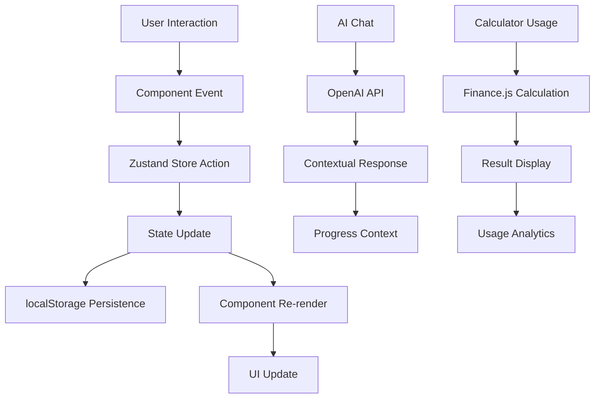

# Finance Quest - Technical Architecture Guide 🏗️

## 🎯 **System Overview**

Finance Quest is a production-ready AI-powered financial literacy platform addressing the 64% financial illiteracy crisis. Built with **Next.js 15.4.4** + **OpenAI GPT-4o-mini**, it provides personalized learning paths through interactive calculators, real-time progress tracking, and contextual AI coaching.

### **Current Architecture Status**
- ✅ **Production-Ready**: 17 available chapters with full educational content
- ✅ **AI Integration**: Real OpenAI GPT-4o-mini integration with contextual coaching
- ✅ **Calculator Suite**: 13+ professional financial calculators with Finance.js
- ✅ **State Management**: Advanced Zustand store with localStorage persistence and analytics
- ✅ **Market Data**: Multi-API integration (Yahoo Finance + Finnhub) with intelligent fallbacks
- ✅ **Theme System**: Centralized design system for consistent UI
- ✅ **Gamification**: Achievement system with guided tours, confetti, and progress tracking

---

## 🏛️ **Core Architecture**

### **Technology Stack**
```typescript
// Frontend Framework
Next.js 15.4.4 (App Router + TypeScript)

// State Management
Zustand ^5.0.6 with localStorage persistence

// AI Integration
OpenAI GPT-4o-mini for contextual coaching

// Financial Calculations
Finance.js ^4.1.0 for accurate financial formulas

// Data Visualization
Recharts ^3.1.0 for interactive charts

// Animations
Framer Motion ^12.23.12 for premium UX

// UI Components
Radix UI + Custom theme system

// Icons
Lucide React ^0.534.0 (SVG-based)
```

### **Project Structure**
```
finance-quest/
├── app/                          # Next.js App Router
│   ├── api/                      # API Routes
│   │   ├── ai-chat/             # OpenAI integration
│   │   └── market-data/         # Multi-API market data
│   ├── chapter[1-17]/           # Educational chapters (17 available)
│   ├── calculators/             # Standalone calculator pages
│   └── layout.tsx               # Root layout with theme
│
├── components/                   # React Components
│   ├── chapters/fundamentals/   # Educational content
│   ├── shared/                  # Reusable components
│   │   ├── calculators/        # 13+ calculator components
│   │   ├── ai-assistant/       # AI coaching interface
│   │   └── ui/                 # Design system components
│   └── demo/                   # Demo and assessment tools
│
├── lib/                         # Core Utilities
│   ├── store/                  # Zustand state management
│   ├── api/                    # External API integrations
│   ├── theme/                  # Centralized theme system
│   └── algorithms/             # Learning algorithms
│
└── docs/                       # Documentation
    ├── README.md               # Main documentation hub
    ├── QUICK_START.md          # 5-minute setup guide
    ├── ARCHITECTURE.md         # This file
    ├── COMPONENT_GUIDE.md      # Component patterns
    └── STATE_MANAGEMENT.md     # Zustand store guide
```

---

## 🔄 **Data Flow Architecture**

### **State Management Flow**


### **Educational Content Flow**
```typescript
// Chapter Navigation Pattern
User starts Chapter 1 (always unlocked)
  ↓
Completes Lesson → Progress tracked in Zustand
  ↓
Uses Calculator → Analytics recorded
  ↓
Takes Quiz → Requires 80%+ to advance
  ↓
Success unlocks Chapter 2 → Process repeats

// Progress Scoring Algorithm (0-1000 scale)
Financial Literacy Score = 
  (Quiz Performance × 40%) +
  (Lesson Completion × 30%) +
  (Calculator Usage Diversity × 20%) +
  (Study Consistency × 10%)
```

### **AI Coaching Context**
```typescript
interface AIContext {
  userProgress: {
    currentChapter: number;
    completedLessons: string[];
    quizScores: Record<string, QuizScore>;
    calculatorUsage: CalculatorUsage[];
    financialLiteracyScore: number;
    strugglingTopics: string[];
  };
  currentContext: {
    chapterId?: number;
    calculatorId?: string;
    questionType: 'general' | 'lesson_help' | 'calculator_help';
  };
  preferences: {
    learningStyle?: 'visual' | 'practical' | 'theoretical';
    difficulty?: 'beginner' | 'intermediate' | 'advanced';
  };
}
```

---

## 🧮 **Calculator Architecture**

### **Financial Calculation Engine**
All calculators use **Finance.js** for accuracy and standardized formulas:

```typescript
import { Finance } from 'financejs';

class FinancialCalculationService {
  private finance = new Finance();

  // Loan payment calculation
  calculateLoanPayment(principal: number, rate: number, periods: number) {
    return this.finance.PMT(rate, periods, -principal, 0, 0);
  }

  // Compound interest
  calculateCompoundInterest(principal: number, rate: number, periods: number, compounds: number) {
    return principal * Math.pow((1 + rate / compounds), compounds * periods);
  }

  // Present value
  calculatePresentValue(futureValue: number, rate: number, periods: number) {
    return this.finance.PV(rate, periods, 0, futureValue, 0);
  }

  // Bond pricing
  calculateBondPrice(faceValue: number, couponRate: number, marketRate: number, periods: number) {
    const couponPayment = (faceValue * couponRate) / 2; // Semi-annual
    return this.finance.PV(marketRate / 2, periods * 2, -couponPayment, -faceValue, 0);
  }
}
```

### **Calculator Component Architecture**
```typescript
interface CalculatorProps {
  onCalculate?: (result: CalculationResult) => void;
  defaultValues?: Record<string, number>;
  showEducationalContent?: boolean;
}

const StandardCalculatorLayout = ({ 
  inputs, 
  results, 
  educationalContent 
}: CalculatorLayoutProps) => (
  <div className="grid grid-cols-1 lg:grid-cols-2 gap-8">
    {/* Input Section */}
    <div className={`${theme.backgrounds.glass} border ${theme.borderColors.primary} rounded-lg p-6`}>
      <h3 className={theme.typography.heading3}>Calculator Inputs</h3>
      {inputs}
    </div>
    
    {/* Results Section */}
    <div className={`${theme.backgrounds.glass} border ${theme.borderColors.primary} rounded-lg p-6`}>
      <h3 className={theme.typography.heading3}>Results</h3>
      {results}
      
      {/* Educational Context */}
      <div className={`${theme.status.info.bg} p-4 rounded-lg mt-4`}>
        <h4 className="font-semibold mb-2">💡 What This Means:</h4>
        {educationalContent}
      </div>
    </div>
  </div>
);
```

---

## 🎨 **Theme System Architecture**

### **Centralized Theme Structure**
Located in `lib/theme/index.ts`:

```typescript
export const theme = {
  // Background patterns
  backgrounds: {
    primary: 'bg-gradient-to-br from-slate-900 via-slate-800 to-slate-900',
    glass: 'bg-white/5 backdrop-blur-xl',
    card: 'bg-slate-800/50 backdrop-blur-sm',
    subtle: 'bg-slate-700/30',
  },

  // Text hierarchy
  textColors: {
    primary: 'text-white',
    secondary: 'text-slate-300',
    muted: 'text-slate-400',
    accent: 'text-yellow-400',
  },

  // Typography scale
  typography: {
    heading1: 'text-4xl md:text-5xl lg:text-6xl font-bold tracking-tight',
    heading2: 'text-3xl md:text-4xl font-bold tracking-tight',
    heading3: 'text-2xl md:text-3xl font-semibold',
    body: 'text-base md:text-lg leading-relaxed',
    caption: 'text-sm text-slate-400',
  },

  // Interactive elements
  buttons: {
    primary: 'bg-gradient-to-r from-blue-600 to-blue-700 hover:from-blue-500 hover:to-blue-600 text-white font-medium py-3 px-6 rounded-lg transition-all duration-200 hover:shadow-lg',
    secondary: 'border border-slate-600 hover:border-slate-500 text-slate-300 hover:text-white font-medium py-3 px-6 rounded-lg transition-all duration-200',
    success: 'bg-gradient-to-r from-green-600 to-green-700 hover:from-green-500 hover:to-green-600 text-white font-medium py-3 px-6 rounded-lg transition-all duration-200',
  },

  // Status indicators
  status: {
    success: {
      bg: 'bg-green-500/10 border border-green-500/20',
      text: 'text-green-400',
      border: 'border-green-500/30',
    },
    warning: {
      bg: 'bg-yellow-500/10 border border-yellow-500/20',
      text: 'text-yellow-400',
      border: 'border-yellow-500/30',
    },
    error: {
      bg: 'bg-red-500/10 border border-red-500/20',
      text: 'text-red-400',
      border: 'border-red-500/30',
    },
    info: {
      bg: 'bg-blue-500/10 border border-blue-500/20',
      text: 'text-blue-400',
      border: 'border-blue-500/30',
    },
  },

  // Border system
  borderColors: {
    primary: 'border-white/10',
    secondary: 'border-slate-600',
    accent: 'border-yellow-500/30',
  },
};
```

### **Theme Usage Patterns**
```typescript
// Good: Use theme variables
className={`${theme.backgrounds.card} ${theme.textColors.primary} ${theme.borderColors.primary}`}

// Good: Combine theme classes
const cardClasses = `${theme.backgrounds.glass} border ${theme.borderColors.primary} rounded-xl p-6`;

// Bad: Hardcoded Tailwind classes
className="bg-slate-800 text-white border-slate-600" // Don't do this
```

---

## 🔌 **API Integration Architecture**

### **OpenAI Integration**
```typescript
// API Route: app/api/ai-chat/route.ts
export async function POST(request: Request) {
  const { message, context } = await request.json();

  const systemPrompt = generateSystemPrompt(context);
  
  const response = await openai.chat.completions.create({
    model: "gpt-4o-mini",
    messages: [
      { role: "system", content: systemPrompt },
      { role: "user", content: message }
    ],
    max_tokens: 500,
    temperature: 0.7,
  });

  return NextResponse.json({
    message: response.choices[0]?.message?.content || "Sorry, I couldn't process that.",
    context: enhanceContext(context),
  });
}

function generateSystemPrompt(userContext: AIContext): string {
  return `You are a professional financial advisor and educator for Finance Quest.
  
  User Progress Context:
  - Current Chapter: ${userContext.userProgress.currentChapter}
  - Financial Literacy Score: ${userContext.userProgress.financialLiteracyScore}/1000
  - Completed Lessons: ${userContext.userProgress.completedLessons.length}
  - Quiz Performance: ${calculateAverageQuizScore(userContext.userProgress.quizScores)}%
  
  Provide helpful, accurate financial education tailored to their progress level.
  Keep responses concise, practical, and encouraging.`;
}
```

### **Market Data Integration**
Multi-API architecture with intelligent fallbacks:

```typescript
class MarketDataService {
  private apis = [
    { name: 'yahoo', handler: this.fetchYahooFinance, priority: 1 },
    { name: 'finnhub', handler: this.fetchFinnhub, priority: 2 },
    { name: 'polygon', handler: this.fetchPolygon, priority: 3 },
    { name: 'alpha_vantage', handler: this.fetchAlphaVantage, priority: 4 },
  ];

  async getStockQuote(symbol: string): Promise<StockQuote> {
    for (const api of this.apis) {
      try {
        const data = await api.handler(symbol);
        if (data && this.validateData(data)) {
          return data;
        }
      } catch (error) {
        console.warn(`${api.name} API failed:`, error);
        continue;
      }
    }
    
    // Fallback to mock data
    return this.generateFallbackData(symbol);
  }

  private generateFallbackData(symbol: string): StockQuote {
    return {
      symbol,
      price: 100 + Math.random() * 50,
      change: (Math.random() - 0.5) * 10,
      changePercent: (Math.random() - 0.5) * 0.1,
      lastUpdated: new Date().toISOString(),
      source: 'fallback',
    };
  }
}
```

---

## 🔒 **Security Architecture**

### **Client-Side Security**
```typescript
// Environment variable validation
const requiredEnvVars = {
  OPENAI_API_KEY: process.env.OPENAI_API_KEY,
  ALPHA_VANTAGE_API_KEY: process.env.ALPHA_VANTAGE_API_KEY,
};

// Input sanitization
const sanitizeUserInput = (input: string): string => {
  return input
    .replace(/[<>]/g, '') // Remove potential XSS vectors
    .trim()
    .slice(0, 1000); // Limit length
};

// API rate limiting (simple client-side)
class RateLimiter {
  private requests: Record<string, number[]> = {};
  
  canMakeRequest(endpoint: string, maxRequests: number = 10, windowMs: number = 60000): boolean {
    const now = Date.now();
    const windowStart = now - windowMs;
    
    if (!this.requests[endpoint]) {
      this.requests[endpoint] = [];
    }
    
    // Clean old requests
    this.requests[endpoint] = this.requests[endpoint].filter(time => time > windowStart);
    
    if (this.requests[endpoint].length >= maxRequests) {
      return false;
    }
    
    this.requests[endpoint].push(now);
    return true;
  }
}
```

### **Data Privacy**
```typescript
// Local storage encryption
const encryptData = (data: string): string => {
  // Simple encryption for local storage
  return btoa(unescape(encodeURIComponent(data)));
};

const decryptData = (encryptedData: string): string => {
  try {
    return decodeURIComponent(escape(atob(encryptedData)));
  } catch {
    return '';
  }
};

// PII handling
const sanitizeProgressData = (progress: UserProgress): UserProgress => {
  return {
    ...progress,
    // Remove any potential PII before logging/analytics
    personalNotes: undefined,
    emailAddress: undefined,
  };
};
```

---

## 📊 **Performance Architecture**

### **Code Splitting Strategy**
```typescript
// Dynamic imports for heavy components
const AdvancedCalculator = dynamic(
  () => import('@/components/shared/calculators/AdvancedCalculator'),
  { 
    loading: () => <CalculatorSkeleton />,
    ssr: false // Client-side only for heavy calculators
  }
);

// Route-based code splitting (automatic with App Router)
app/
├── chapter1/page.tsx          # Separate bundle
├── chapter2/page.tsx          # Separate bundle
├── calculators/page.tsx       # Separate bundle
└── assessment/page.tsx        # Separate bundle
```

### **State Management Performance**
```typescript
// Zustand optimizations
export const useProgressStore = create<ProgressState>()(
  subscribeWithSelector(
    persist(
      immer((set, get) => ({
        // Use Immer for immutable updates
        completeLesson: (lessonId: string, timeSpent: number) => 
          set((state) => {
            if (!state.userProgress.completedLessons.includes(lessonId)) {
              state.userProgress.completedLessons.push(lessonId);
              state.userProgress.totalTimeSpent += timeSpent;
            }
          }),
      })),
      { name: 'finance-quest-progress' }
    )
  )
);

// Selective subscriptions to prevent re-renders
const specificData = useProgressStore(
  state => state.userProgress.financialLiteracyScore,
  shallow
);
```

### **Asset Optimization**
```typescript
// Image optimization with Next.js
import Image from 'next/image';

const OptimizedImage = ({ src, alt }: ImageProps) => (
  <Image
    src={src}
    alt={alt}
    width={800}
    height={600}
    priority={false}
    loading="lazy"
    placeholder="blur"
    blurDataURL="data:image/jpeg;base64,..."
  />
);
```

---

## 🧪 **Testing Architecture**

### **Testing Strategy**
```typescript
// Unit tests for store actions
describe('Progress Store', () => {
  beforeEach(() => {
    useProgressStore.getState().resetProgress();
  });

  it('should complete lessons correctly', () => {
    const { completeLesson } = useProgressStore.getState();
    completeLesson('chapter1-lesson1', 300);
    
    const progress = useProgressStore.getState().userProgress;
    expect(progress.completedLessons).toContain('chapter1-lesson1');
  });
});

// Integration tests for calculators
describe('Compound Interest Calculator', () => {
  it('should calculate compound interest correctly', () => {
    const result = calculateCompoundInterest(1000, 0.05, 10, 12);
    expect(result).toBeCloseTo(1643.62, 2);
  });
});

// E2E tests for user flows
describe('Chapter Progression', () => {
  it('should unlock next chapter after quiz completion', () => {
    cy.visit('/chapter1');
    cy.get('[data-testid="lesson-complete"]').click();
    cy.get('[data-testid="quiz-tab"]').click();
    cy.get('[data-testid="quiz-answer"]').first().click();
    cy.get('[data-testid="submit-quiz"]').click();
    cy.url().should('include', '/chapter2');
  });
});
```

---

## 🚀 **Deployment Architecture**

### **Build Optimization**
```typescript
// next.config.ts
const nextConfig: NextConfig = {
  // Enable Turbopack for faster builds
  experimental: {
    turbo: {
      rules: {
        '*.svg': {
          loaders: ['@svgr/webpack'],
          as: '*.js',
        },
      },
    },
  },

  // Bundle analysis
  env: {
    ANALYZE: process.env.ANALYZE,
  },

  // Image optimization
  images: {
    formats: ['image/webp', 'image/avif'],
    dangerouslyAllowSVG: true,
  },

  // Compression
  compress: true,
  
  // Static export (if needed)
  output: process.env.BUILD_MODE === 'static' ? 'export' : undefined,
};
```

### **Environment Configuration**
```bash
# Development
NEXT_PUBLIC_ENV=development
OPENAI_API_KEY=sk-...
ALPHA_VANTAGE_API_KEY=...

# Production
NEXT_PUBLIC_ENV=production
OPENAI_API_KEY=sk-...
ALPHA_VANTAGE_API_KEY=...
NODE_ENV=production
```

---

## 🔄 **Migration & Versioning**

### **Store Migration Strategy**
```typescript
const progressStoreMigrations = {
  1: (state: any) => ({
    ...state,
    userProgress: {
      ...state.userProgress,
      studyStreak: 1, // Add new field
    },
  }),
  
  2: (state: any) => ({
    ...state,
    userProgress: {
      ...state.userProgress,
      masteryByTopic: {}, // Add topic mastery tracking
    },
  }),
};

export const useProgressStore = create<ProgressState>()(
  persist(
    (set, get) => ({ /* store implementation */ }),
    {
      name: 'finance-quest-progress',
      version: 2,
      migrate: (persistedState: any, version: number) => {
        let migratedState = persistedState;
        
        for (let v = version; v < 2; v++) {
          migratedState = progressStoreMigrations[v + 1](migratedState);
        }
        
        return migratedState;
      },
    }
  )
);
```

---

## 📈 **Monitoring & Analytics**

### **Performance Monitoring**
```typescript
// Custom performance tracking
class PerformanceMonitor {
  static trackPageLoad(pageName: string) {
    const observer = new PerformanceObserver((list) => {
      const entries = list.getEntries();
      const pageLoadTime = entries[0]?.duration;
      
      // Send to analytics
      this.recordMetric('page_load_time', pageLoadTime, { page: pageName });
    });
    
    observer.observe({ entryTypes: ['navigation'] });
  }
  
  static trackCalculatorUsage(calculatorId: string, inputs: any, results: any) {
    this.recordMetric('calculator_usage', 1, {
      calculator: calculatorId,
      inputs: JSON.stringify(inputs),
      timestamp: new Date().toISOString(),
    });
  }
  
  private static recordMetric(name: string, value: number, tags: Record<string, any>) {
    // Implementation for your analytics provider
    console.log(`Metric: ${name}`, { value, tags });
  }
}
```

### **Error Tracking**
```typescript
// Global error boundary
class ErrorBoundary extends React.Component {
  componentDidCatch(error: Error, errorInfo: React.ErrorInfo) {
    // Log error to monitoring service
    console.error('Application Error:', error, errorInfo);
    
    // Track in analytics
    PerformanceMonitor.recordMetric('error_boundary_triggered', 1, {
      error: error.message,
      stack: error.stack,
      componentStack: errorInfo.componentStack,
    });
  }
  
  render() {
    if (this.state.hasError) {
      return <ErrorFallback />;
    }
    
    return this.props.children;
  }
}
```

---

## 🔮 **Future Architecture Considerations**

### **Scalability Roadmap**
```typescript
// Planned enhancements
interface FutureArchitecture {
  backend: {
    // User authentication & profiles
    authentication: 'NextAuth.js | Clerk | Auth0';
    
    // Progress synchronization
    database: 'PostgreSQL | MongoDB | Supabase';
    
    // Real-time features
    realtime: 'WebSockets | Server-Sent Events';
    
    // API layer
    graphql: 'Apollo Server | Hasura | tRPC';
  };
  
  ai: {
    // Advanced AI features
    personalizedLearning: 'Custom ML models';
    speechToText: 'OpenAI Whisper';
    voiceCoaching: 'Text-to-Speech APIs';
    adaptiveTesting: 'Spaced repetition algorithms';
  };
  
  integrations: {
    // Financial data
    brokerageAPIs: 'Plaid | Yodlee | Finicity';
    cryptoData: 'CoinGecko | CoinMarketCap';
    newsFeeds: 'Financial news APIs';
    
    // Social features
    socialLearning: 'Comments | Study groups';
    leaderboards: 'Competitive learning';
    achievements: 'Gamification system';
  };
}
```

### **Performance Targets**
```typescript
// Performance benchmarks
const performanceTargets = {
  pageLoad: '<2s First Contentful Paint',
  interaction: '<100ms Time to Interactive',
  calculator: '<50ms Calculation response',
  ai: '<3s AI response time',
  accessibility: 'WCAG 2.1 AA compliance',
  lighthouse: '>90 Performance Score',
};
```

---

## 📚 **Related Documentation**

### **Core Guides**
- [Quick Start Guide](QUICK_START.md) - Get up and running in 5 minutes
- [Component Guide](COMPONENT_GUIDE.md) - Component patterns and standards
- [State Management Guide](STATE_MANAGEMENT.md) - Zustand store deep dive

### **Specialized Guides**
- [API Integration](API_INTEGRATION.md) - External API usage patterns
- [Testing Strategy](TESTING.md) - Comprehensive testing approach
- [Deployment Guide](DEPLOYMENT.md) - Production deployment strategies

---

**🏗️ This architecture supports Finance Quest's mission to provide world-class financial education through modern web technologies and AI-powered personalization.**

*Questions about the architecture? Check the [Quick Start Guide](QUICK_START.md) or explore the [component examples](../components/) for practical implementations.*
