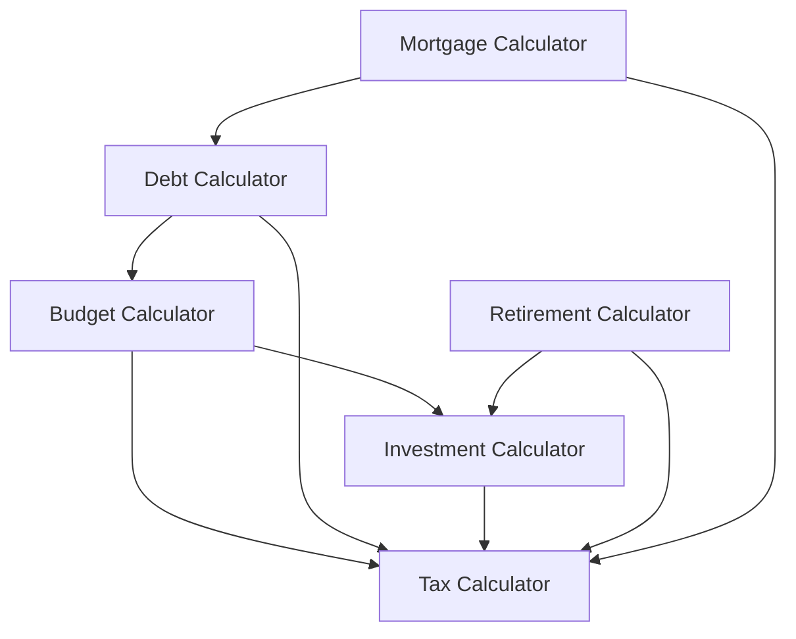

# Calculator Integration Guide

## Overview

This guide explains how our calculators integrate with each other and share common functionality. Understanding these integrations is crucial for maintaining consistency and accuracy across the application.

## Table of Contents

- [Common Concepts](#common-concepts)
- [Calculator Dependencies](#calculator-dependencies)
- [Shared Calculations](#shared-calculations)
- [Integration Points](#integration-points)
- [Best Practices](#best-practices)
- [Testing Guidelines](#testing-guidelines)

## Common Concepts

### Financial Ratios

All calculators use standardized financial ratios from `financialCalculations.ts`:

```typescript
// Common financial ratios used across calculators
financialRatios.maxDTI; // Maximum debt-to-income ratio
financialRatios.minSavingsRate; // Minimum recommended savings rate
financialRatios.moderateReturn; // Moderate investment return threshold
financialRatios.maxExpenseRatio; // Maximum expense ratio for investments
```

### Risk Assessment

Risk tolerance is consistently evaluated across investment-related calculators:

```typescript
type RiskTolerance = "conservative" | "moderate" | "aggressive";

const returnThresholds = {
  conservative: financialRatios.conservativeReturn, // e.g., 5%
  moderate: financialRatios.moderateReturn, // e.g., 7%
  aggressive: financialRatios.aggressiveReturn, // e.g., 10%
};
```

## Calculator Dependencies

### Primary Dependencies



### Data Flow Examples

1. **Budget → Tax → Investment**

   ```typescript
   // Budget provides income and expenses
   const { afterTaxIncome } = taxCalculator.compute(budgetData);
   const investmentCapacity = calculateInvestmentCapacity(
     afterTaxIncome,
     expenses
   );
   ```

2. **Mortgage → Debt → Tax**
   ```typescript
   // Mortgage provides loan details
   const { interestPaid } = mortgageCalculator.compute(loanData);
   const { deductions } = taxCalculator.compute({
     mortgageInterest: interestPaid,
   });
   ```

## Shared Calculations

### 1. Debt-to-Income (DTI) Ratio

Used in Budget, Debt, and Mortgage calculators:

```typescript
function calculateDTI(monthlyDebt: number, monthlyIncome: number): number {
  return (monthlyDebt / monthlyIncome) * 100;
}

// Usage across calculators
const dti = calculateDTI(totalDebtPayments, grossMonthlyIncome);
if (dti > financialRatios.maxDTI) {
  insights.push({
    type: "warning",
    message: `DTI ratio of ${dti.toFixed(1)}% exceeds recommended maximum`,
  });
}
```

### 2. Investment Returns

Shared between Investment and Retirement calculators:

```typescript
function calculateFutureValue(
  principal: number,
  rate: number,
  years: number,
  monthlyContribution?: number
): number {
  // Consistent calculation across investment-related calculators
  return futureValue;
}

// Risk-adjusted returns
function validateReturnExpectations(
  expectedReturn: number,
  riskTolerance: RiskTolerance
): boolean {
  return expectedReturn <= returnThresholds[riskTolerance];
}
```

### 3. Tax Impact

Shared across multiple calculators:

```typescript
interface TaxableItem {
  amount: number;
  isDeductible: boolean;
  category?: string;
}

function calculateAfterTaxValue(
  value: number,
  taxRate: number,
  deductions: TaxableItem[]
): number {
  // Consistent after-tax calculation
  return afterTaxValue;
}
```

## Integration Points

### 1. Budget and Investment Integration

```typescript
interface BudgetInvestmentIntegration {
  // Monthly savings from budget feeds into investment calculator
  monthlySavings: number;
  // Investment returns feed back into budget projections
  expectedReturns: number;
  // Risk tolerance affects both asset allocation and budget safety margin
  riskTolerance: RiskTolerance;
}
```

### 2. Debt and Tax Integration

```typescript
interface DebtTaxIntegration {
  // Track tax-deductible interest across debt types
  deductibleInterest: {
    mortgage: number;
    studentLoan: number;
    investmentInterest: number;
  };
  // Calculate tax savings from deductible interest
  taxSavings: number;
}
```

### 3. Retirement and Investment Integration

```typescript
interface RetirementInvestmentIntegration {
  // Shared portfolio modeling
  assetAllocation: AssetAllocation;
  // Consistent return assumptions
  expectedReturns: ReturnAssumptions;
  // Risk management
  riskMetrics: RiskMetrics;
}
```

## Best Practices

### 1. Maintain Consistency

```typescript
// Use shared utilities for common calculations
import {
  calculateFutureValue,
  calculateDTI,
  validateRiskLevel,
} from "@/lib/utils/financialCalculations";

// Use shared formatters
import { formatCurrency, formatPercentage } from "@/lib/utils/formatters";
```

### 2. Handle Cross-Calculator Updates

```typescript
// When a calculation affects multiple calculators
function updateRelatedCalculators(
  sourceCalculator: string,
  updates: CalculatorUpdates
): void {
  // Update dependent calculators
  dependentCalculators.forEach((calculator) => {
    calculator.handleUpdate(updates);
  });
}
```

### 3. Validate Cross-Calculator Results

```typescript
// Ensure consistent results across calculators
function validateResults(results: CalculatorResults[]): void {
  // Check for discrepancies in shared metrics
  validateSharedMetrics(results);
  // Verify calculation consistency
  verifyCalculationConsistency(results);
}
```

## Testing Guidelines

### 1. Cross-Calculator Tests

```typescript
describe("Cross Calculator Validation", () => {
  it("should maintain consistent DTI across calculators", () => {
    // Test DTI calculation consistency
  });

  it("should handle tax implications consistently", () => {
    // Test tax calculation consistency
  });

  it("should maintain consistent investment returns", () => {
    // Test investment return consistency
  });
});
```

### 2. Integration Tests

```typescript
describe("Calculator Integration", () => {
  it("should propagate updates correctly", () => {
    // Test update propagation
  });

  it("should maintain data consistency", () => {
    // Test data consistency
  });

  it("should handle cross-calculator scenarios", () => {
    // Test complex scenarios
  });
});
```

### 3. Edge Cases

```typescript
describe("Edge Cases", () => {
  it("should handle zero income edge case", () => {
    // Test zero income scenario
  });

  it("should handle maximum value limits", () => {
    // Test upper bounds
  });

  it("should handle negative cash flow", () => {
    // Test negative scenarios
  });
});
```

For more detailed examples and implementations, see the calculator implementations in the `lib/hooks/calculators/` directory and their corresponding tests in `__tests__/calculators/`.

